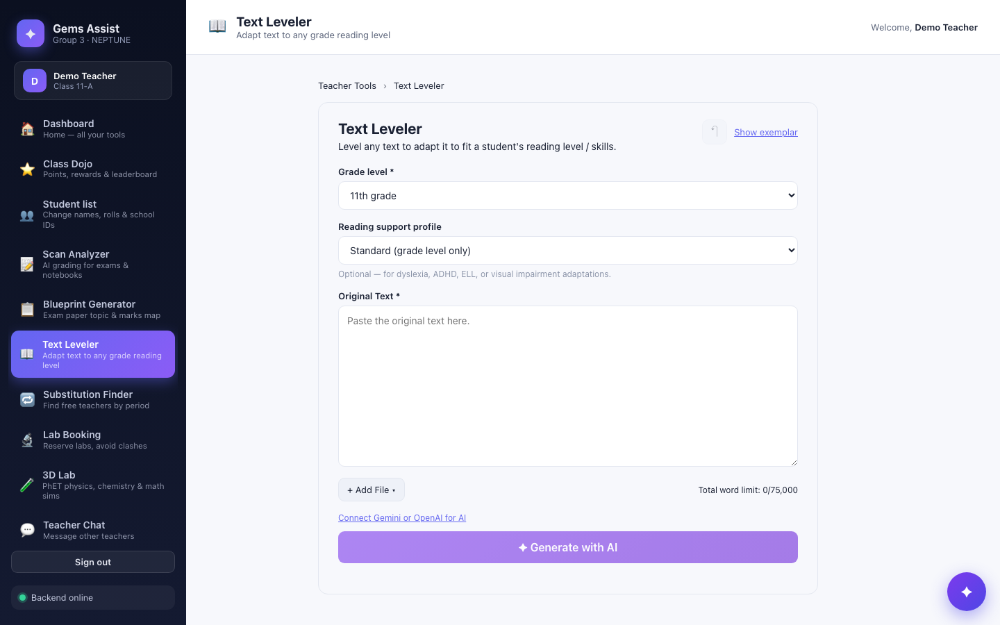
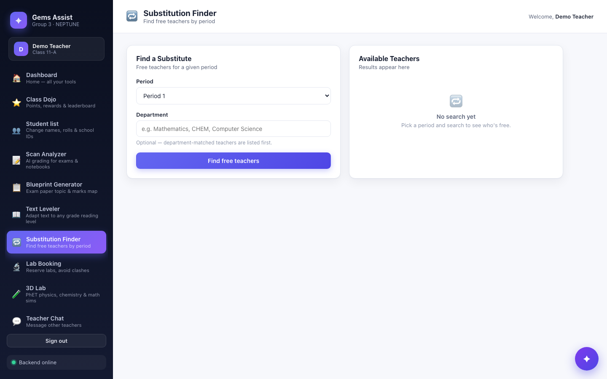
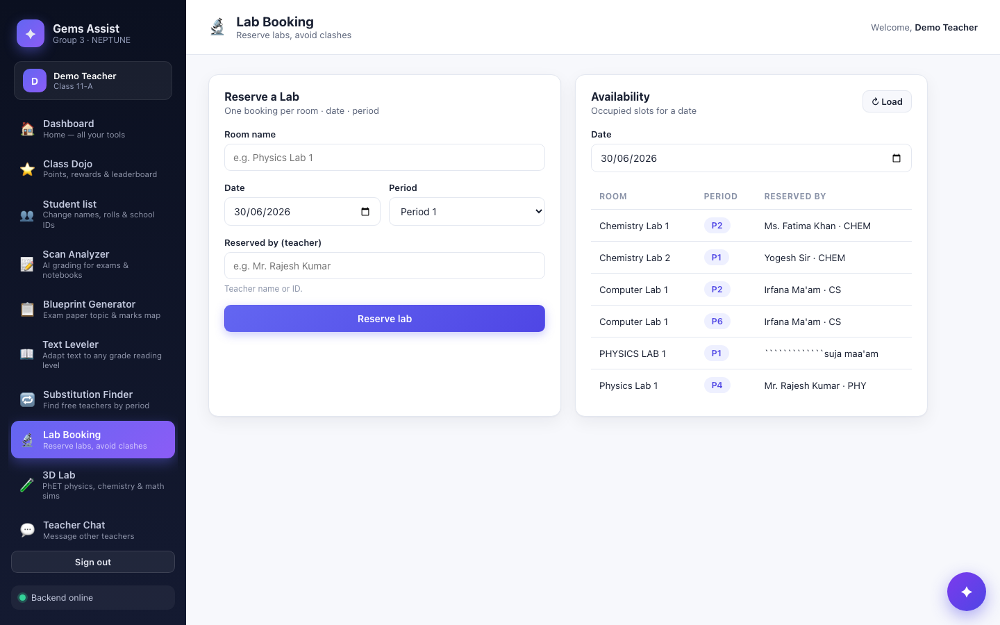
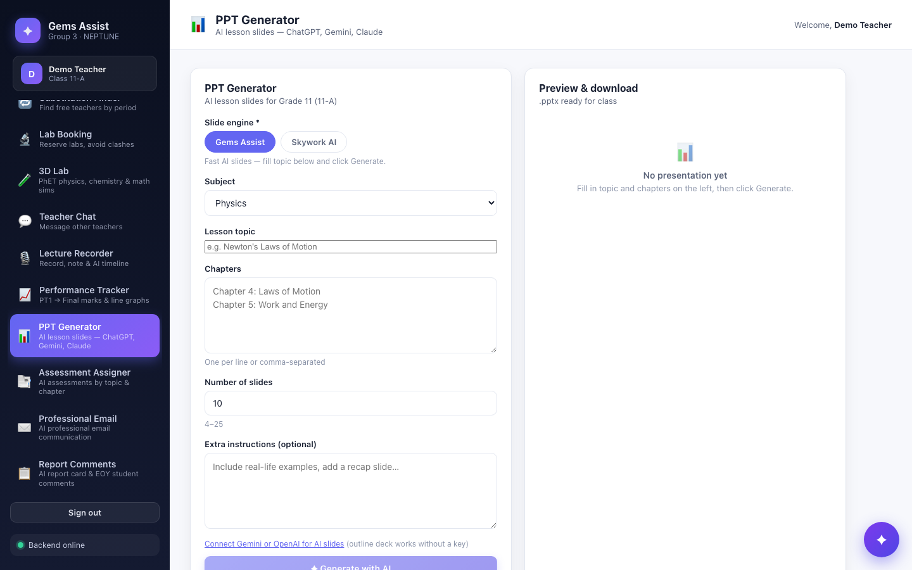

<p align="center">
  
</p>

<h1 align="center">Gems Assist</h1>

<p align="center">
  <strong>Group 3 (NEPTUNE)</strong><br />
  Farhan Mohammed Rangrej · Kailas · Roselin
</p>

<p align="center">
  AI-powered education platform for CBSE teachers — grading, differentiation, labs, parent mail, performance tracking, and a student token economy.
</p>

<p align="center">
  <a href="https://gems-class-flow.base44.app"><strong>🌐 Live demo →</strong></a>
  &nbsp;·&nbsp;
  <a href="http://localhost:5173"><strong>Local :5173 →</strong></a>
  &nbsp;·&nbsp;
  <a href="http://localhost:4000/health"><strong>API health →</strong></a>
  &nbsp;·&nbsp;
  <a href="https://github.com/FARHANMOHAMMED-R/Gems-Hackathon"><strong>GitHub →</strong></a>
</p>

<p align="center">
  
</p>

---

## Project overview

**Gems Assist** is a full-stack teacher workspace built for the GEMS Hackathon. It replaces scattered spreadsheets and manual workflows with one app where CBSE teachers can:

- **Grade faster** — OCR exam papers and notebooks with multi-provider AI
- **Differentiate instruction** — adapt any passage to a target grade level (Text Leveler)
- **Run the school day** — find substitute teachers by period, book labs without double-booking
- **Communicate** — draft parent emails, generate assessments, and award student tokens

The stack is **React + Vite** on the frontend, **Express + Prisma + SQLite** on the backend, with **OpenAI, Gemini, and Claude** for AI features. Teachers sign in with name and class; admins use passcode `farhan`.

---

## Live demo links

| | URL |
|---|---|
| **Hosted app (any device)** | [**https://gems-class-flow.base44.app**](https://gems-class-flow.base44.app) |
| **Local website** | [http://localhost:5173](http://localhost:5173) |
| **Local API** | [http://localhost:4000](http://localhost:4000) |
| **Health check** | [http://localhost:4000/health](http://localhost:4000/health) |
| **GitHub** | [github.com/FARHANMOHAMMED-R/Gems-Hackathon](https://github.com/FARHANMOHAMMED-R/Gems-Hackathon) |

> **Note:** The hosted base44 link is frontend-only. For the full stack (API + AI), run locally or use `npm run share` to expose your local app publicly.

### Share local app on any network

```bash
npm run share
```

Starts **http://localhost:5173** and prints a public **https://…** link for phones, tablets, or laptops on any network.

---

## Key features

| Feature | What you get |
|---------|----------------|
| **Scan Analyzer** | OCR exam papers & notebooks (OpenAI, Gemini, Claude, PDF Guru, Tesseract) |
| **Blueprint Generator** | Upload a past paper → topic & marks breakdown |
| **Text Leveler** | Rewrite any passage for a target grade level (Gemini / OpenAI) |
| **PPT Generator** | AI lesson slides (ChatGPT, Gemini, Claude) or offline template `.pptx` |
| **Substitution Finder** | See which teachers are free by period |
| **Lab Booking** | Reserve rooms with double-booking protection |
| **3D Lab** | 115 unique PhET simulations (physics, chemistry & math) |
| **Class Roster** | Add, edit, import students by roll number, school ID & parent email |
| **Performance Tracker** | Enter PT1 → Half Yearly → PT2 → Final marks; line graphs per student |
| **Parent Mailer** | Draft & send parent update emails (Resend or SMTP) |
| **Assessment Assigner** | AI-generated assessments by chapter, topic & difficulty |
| **Token Matrix** | Award points for answering, kindness & peer support |
| **Lecture Recorder** | Record class audio, pin timestamped notes, AI timeline & summary |
| **Teacher Chat** | Staff lounge for cross-class messages |
| **Admin Dashboard** | Manage labs, broadcast notices, monitor teachers online |

**Sign in**

| Role | How |
|------|-----|
| Teacher | Name, class (e.g. `11-A`), email |
| Admin | Passcode `farhan` |

### Demo data (pre-loaded for judges)

When you run the backend locally, demo data syncs automatically:

| Tool | Demo state |
|------|------------|
| **Substitution Finder** | Irfana Ma'am (CS), Tina Ma'am (Math), Yogesh Sir (CHEM) — each with realistic free/busy periods |
| **Lab Booking** | Chemistry Lab 2 — Period 1 (Yogesh Sir); Computer Lab 1 — Periods 2 & 6 (Irfana Ma'am) |

Run `npm run seed` to reset demo data manually.

---

## Screenshots

<table>
  <tr>
    <td width="50%">
      
      <br /><sub><b>Sign in</b> — teacher or admin</sub>
    </td>
    <td width="50%">
      
      <br /><sub><b>Dashboard</b> — token leaderboard & quick tools</sub>
    </td>
  </tr>
  <tr>
    <td width="50%">
      
      <br /><sub><b>Scan Analyzer</b> — exam & notebook OCR</sub>
    </td>
    <td width="50%">
      
      <br /><sub><b>Blueprint Generator</b> — marks & topic map</sub>
    </td>
  </tr>
  <tr>
    <td width="50%">
      
      <br /><sub><b>Text Leveler</b> — adapt text to any grade</sub>
    </td>
    <td width="50%">
      
      <br /><sub><b>Substitution Finder</b> — Irfana, Tina, Yogesh</sub>
    </td>
  </tr>
  <tr>
    <td width="50%">
      
      <br /><sub><b>Lab Booking</b> — Chemistry Lab 2 & Computer Lab</sub>
    </td>
    <td width="50%">
      
      <br /><sub><b>PPT Generator</b> — AI lesson slides</sub>
    </td>
  </tr>
</table>

Regenerate screenshots (with dev servers running):

```bash
node scripts/capture-readme-screenshots.mjs
```

---

## Quick start

**Requirements:** Node.js 18+, npm 9+

```bash
git clone https://github.com/FARHANMOHAMMED-R/Gems-Hackathon.git
cd Gems-Hackathon

# Backend
npm install
cp .env.example .env          # add API keys for AI features (see below)
npm run prisma:generate
npm run prisma:push
npm run seed                  # optional demo data

# Terminal 1 — API
npm run dev                   # → http://localhost:4000

# Terminal 2 — website
cd frontend && npm install && npm run dev   # → http://localhost:5173
```

Open **http://localhost:5173**, sign in as a teacher, set up your class roster, and explore.

### Run as one site on :5173

```bash
npm run site
# → http://localhost:5173  (same Wi‑Fi: http://YOUR-LAN-IP:5173)
```

---

## AI providers

Configure one or more keys in backend `.env` — the app picks the best available provider:

| Provider | Env variable | Used for |
|----------|--------------|----------|
| **ChatGPT** | `OPENAI_API_KEY` | Grading, PPT, mail, assessments, Whisper OCR |
| **Gemini** | `GEMINI_API_KEY` | Free-tier text, vision OCR, audio transcription |
| **Claude** | `ANTHROPIC_API_KEY` | Text, vision OCR, summaries |

Set `LLM_DEFAULT_PROVIDER=openai|gemini|claude` when multiple keys are present. Gemini is the default for Text Leveler and PPT Generator when configured.

---

## Environment variables

Copy [`.env.example`](.env.example) → `.env` at the repo root.

| Variable | Purpose |
|----------|---------|
| `OPENAI_API_KEY` | ChatGPT — grading, PPT, mail, Whisper speech-to-text |
| `GEMINI_API_KEY` | Free Gemini — OCR, transcription, PPT ([get key](https://aistudio.google.com/apikey)) |
| `ANTHROPIC_API_KEY` | Claude — text & vision OCR |
| `GURUPDF_API_KEY` | PDF Guru image-to-text for scans ([get key](https://gurupdf.com/api)) |
| `WHISPER_MODEL` | OpenAI Whisper model (default `whisper-1`) |
| `LLM_DEFAULT_PROVIDER` | Preferred AI when multiple keys set (`openai` \| `gemini` \| `claude`) |
| `RESEND_API_KEY` / SMTP | Parent Mailer & Assessment email delivery |
| `PORT` / `HOST` | Backend port (default `4000`) and bind address (`0.0.0.0` for LAN) |
| `DATABASE_URL` | SQLite path (default `file:./dev.db`) |

Frontend optional: `VITE_API_BASE` — set only when deploying without the Vite dev proxy.

---

## Architecture

```
Browser  →  React + Vite (:5173)  →  /api proxy  →  Express + Prisma (:4000)  →  SQLite + LLM
```

| Layer | Stack |
|-------|-------|
| Frontend | React · Vite · TypeScript |
| Backend | Node · Express · Prisma · SQLite |
| AI | OpenAI · Gemini · Claude · PDF Guru OCR · Whisper · local Tesseract fallback |

---

## API overview

| Method | Path | Description |
|--------|------|-------------|
| `GET` | `/health` | Liveness |
| `POST` | `/api/analyze-scan` | OCR + grade exam or notebook |
| `GET` | `/api/scan/ocr-status` | Which OCR backends are configured |
| `POST` | `/api/generate-blueprint` | Exam topic & marks blueprint |
| `POST` | `/api/differentiate-content` | Adapt lesson content (Text Leveler) |
| `GET` | `/api/substitution/check-free` | Free teachers by period |
| `POST` | `/api/labs/reserve` | Book a lab slot |
| `GET` | `/api/labs/availability` | Daily availability grid |
| `POST` | `/api/generate-mail` | Draft parent email |
| `POST` | `/api/send-mail` | Send parent email |
| `POST` | `/api/generate-assessment` | AI assessment from topics & chapters |
| `POST` | `/api/send-assessment` | Email assessment to all parents |
| `POST` | `/api/generate-ppt` | AI or template PowerPoint deck |
| `GET` | `/api/ai/providers` | Configured AI providers |
| `GET` | `/api/performance` | Term marks for a class & subject |
| `POST` | `/api/performance/marks` | Save PT1 / Half Yearly / PT2 / Final marks |
| `POST` | `/api/lecture/process` | Transcribe recording → timeline & summary |
| `GET` | `/api/lectures` | List saved lectures |
| `POST` | `/api/tokens/award` | Award student tokens |
| `GET` | `/api/tokens/leaderboard` | Class leaderboard |
| `POST` | `/api/teachers/sign-in` | Teacher session |
| `GET/POST` | `/api/students/*` | Class roster CRUD & import |
| `GET/POST` | `/api/chat/*` | Teacher staff lounge |
| `GET/POST` | `/api/notifications/*` | Admin broadcasts |
| `GET` | `/api/admin/monitor` | Online teachers & student stats |

Admin lab routes require header `X-Admin-Passcode: farhan`.

Full route implementations live in [`src/routes/`](src/routes/).

---

## Project structure

```
Gems-Hackathon/
├── docs/screenshots/       # README screenshots
├── prisma/                 # Schema & seed
├── src/
│   ├── index.ts            # Express app
│   ├── lib/                # LLM, OCR, audio, PPT, demo data helpers
│   └── routes/             # REST endpoints
└── frontend/
    ├── src/pages/          # All app screens
    ├── src/components/     # Shared UI
    └── vite.config.ts      # Dev proxy → :4000
```

---

## Scripts

| Location | Command | Description |
|----------|---------|-------------|
| Root | `npm run share` | **Local :5173 → public https link** (one command) |
| Root | `npm run site` | Build + run full app at **http://localhost:5173** |
| Root | `npm run dev` | Backend with hot reload |
| Root | `npm run seed` | Load demo teachers & lab bookings |
| Root | `npm run build:all` | Build backend + frontend |
| `frontend/` | `npm run dev` | Website at **http://localhost:5173** |
| `frontend/` | `npm run build` | Production bundle |

---

## Deploy

**Universal frontend (already live):** [https://gems-class-flow.base44.app](https://gems-class-flow.base44.app)

To deploy your own copy:

```bash
cd frontend
VITE_API_BASE=https://your-api.example.com npm run build
```

Serve `frontend/dist/` from any static host. Run the Express API separately and enable CORS for your frontend origin.

---

## Team — Group 3 (NEPTUNE)

| Member |
|--------|
| Farhan Mohammed Rangrej |
| Kailas |
| Roselin |

---

## License

MIT · [GEMS Hackathon](https://github.com/FARHANMOHAMMED-R/Gems-Hackathon)
