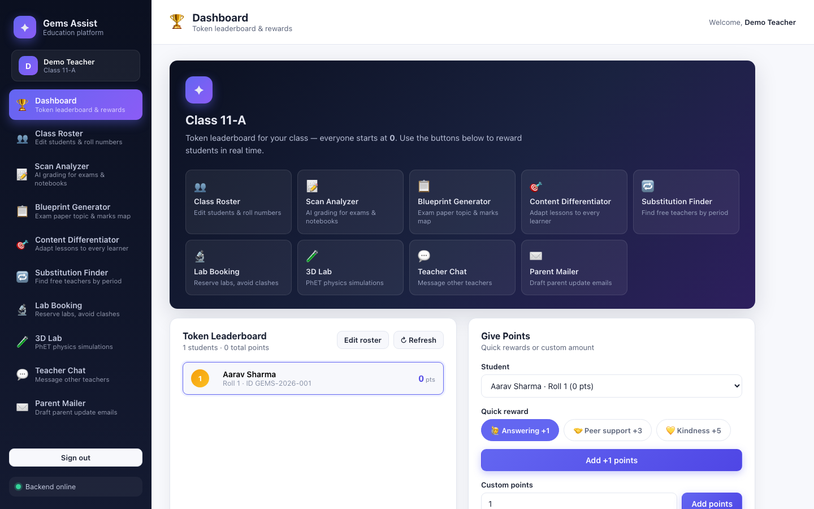
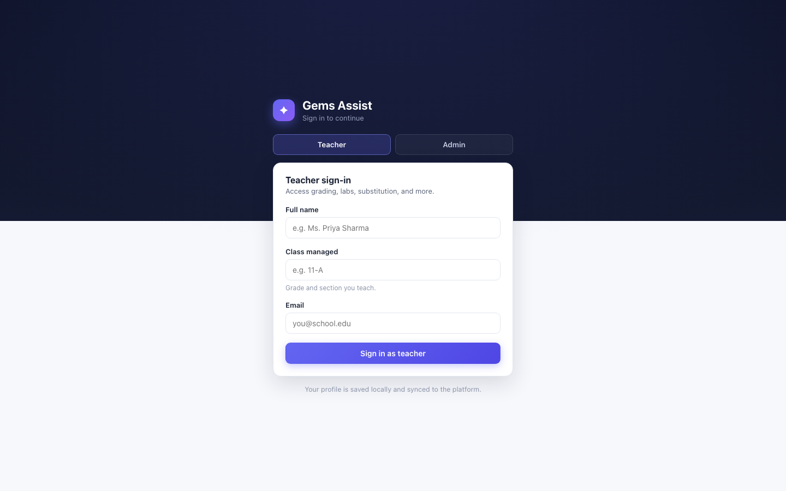
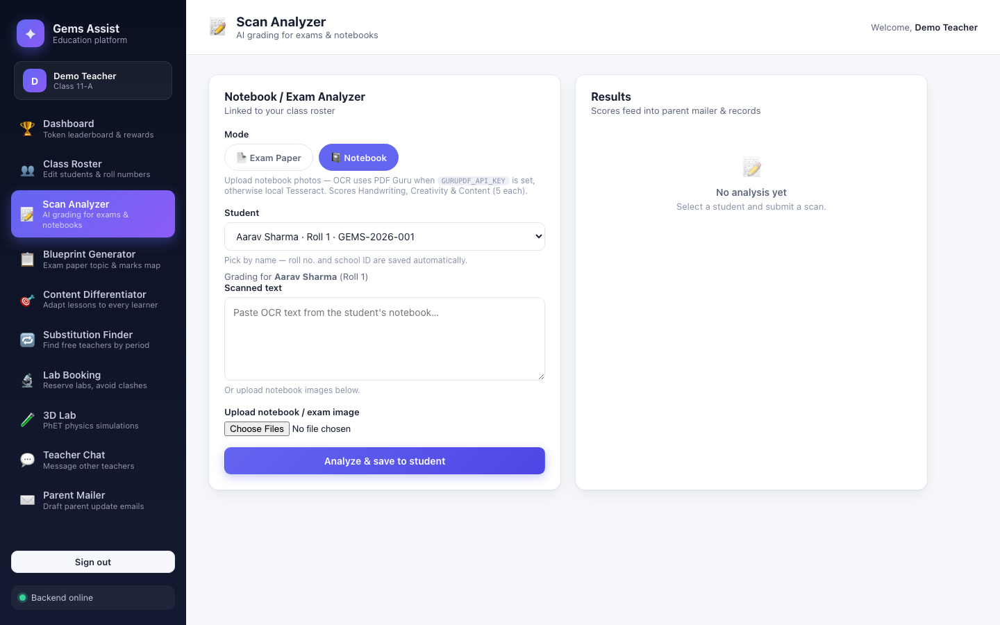
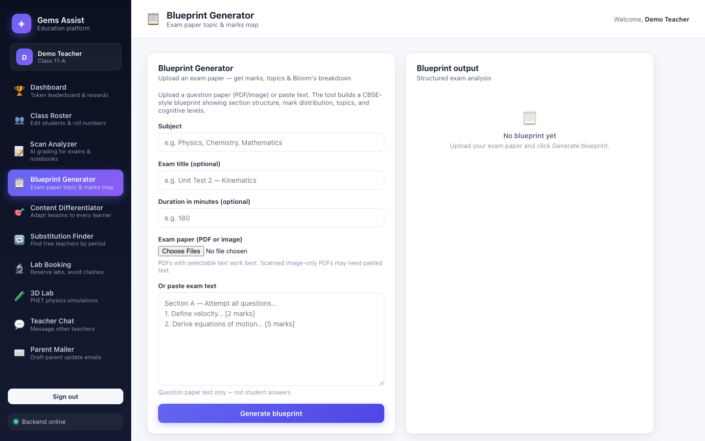

<p align="center">
  
</p>

<h1 align="center">Gems Assist</h1>

<p align="center">
  AI-powered education platform for CBSE teachers — grading, differentiation, labs, parent mail, and a student token economy.
</p>

<p align="center">
  <a href="http://localhost:5173"><strong>Open local app →</strong></a>
  &nbsp;·&nbsp;
  <a href="https://gems-class-flow.base44.app">Live demo</a>
  &nbsp;·&nbsp;
  <a href="https://github.com/FARHANMOHAMMED-R/Gems-Hackathon">GitHub</a>
</p>

<p align="center">
  
</p>

---

## Quick links

| | URL |
|---|---|
| **Local website** | [**http://localhost:5173**](http://localhost:5173) |
| **Local API** | [http://localhost:4000](http://localhost:4000) |
| **Health check** | [http://localhost:4000/health](http://localhost:4000/health) |
| **Live demo** | [https://gems-class-flow.base44.app](https://gems-class-flow.base44.app) |

> Start backend + frontend (see [Quick start](#quick-start)), then open **http://localhost:5173** in your browser.

---

## What it does

Gems Assist gives teachers one place to run a modern classroom:

| Feature | What you get |
|---------|----------------|
| **Class Roster** | Add, edit, import students by roll number & school ID |
| **Scan Analyzer** | OCR exam papers & notebooks (PDF Guru, OpenAI, or local Tesseract) |
| **Blueprint Generator** | Upload a past paper → topic & marks breakdown |
| **Content Differentiator** | Rewrite lessons for Advanced, Standard, Visual, or Neurodivergent tracks |
| **Substitution Finder** | See which teachers are free by period |
| **Lab Booking** | Reserve rooms with double-booking protection |
| **3D Lab** | 64 embedded PhET physics simulations |
| **Teacher Chat** | Staff lounge for cross-class messages |
| **Parent Mailer** | Batch draft compassionate parent update emails |
| **Token Matrix** | Award points for answering, kindness & peer support |
| **Admin Dashboard** | Manage labs, broadcast notices, monitor teachers online |

**Sign in**

| Role | How |
|------|-----|
| Teacher | Name, class (e.g. `11-A`), email |
| Admin | Passcode `farhan` |

---

## Screenshots

<table>
  <tr>
    <td width="50%">
      
      <br /><sub><b>Sign in</b> — teacher or admin</sub>
    </td>
    <td width="50%">
      
      <br /><sub><b>Scan Analyzer</b> — exam & notebook OCR</sub>
    </td>
  </tr>
  <tr>
    <td width="50%">
      
      <br /><sub><b>Blueprint Generator</b> — marks & topic map</sub>
    </td>
    <td width="50%">
      
      <br /><sub><b>Dashboard</b> — token leaderboard</sub>
    </td>
  </tr>
</table>

---

## Quick start

**Requirements:** Node.js 18+, npm 9+

```bash
git clone https://github.com/FARHANMOHAMMED-R/Gems-Hackathon.git
cd Gems-Hackathon

# Backend
npm install
cp .env.example .env          # add OPENAI_API_KEY & GURUPDF_API_KEY for AI features
npm run prisma:generate
npm run prisma:push
npm run seed                  # optional demo data

# Terminal 1 — API
npm run dev                   # → http://localhost:4000

# Terminal 2 — website
cd frontend && npm install && npm run dev   # → http://localhost:5173
```

Open **http://localhost:5173**, sign in as a teacher, set up your class roster, and explore.

### Share on other devices (same Wi‑Fi)

Vite prints a **Network** URL when the frontend starts, e.g. `http://192.168.1.42:5173`.  
Other phones and laptops on the same Wi‑Fi can open that link — the dev server proxies `/api` to your machine.

---

## Environment variables

Copy [`.env.example`](.env.example) → `.env` at the repo root.

| Variable | Purpose |
|----------|---------|
| `OPENAI_API_KEY` | AI grading, differentiation, mail (optional for offline features) |
| `GURUPDF_API_KEY` | PDF Guru image-to-text OCR for scans ([get key](https://gurupdf.com/api)) |
| `PORT` / `HOST` | Backend port (default `4000`) and bind address (`0.0.0.0` for LAN) |
| `DATABASE_URL` | SQLite path (default `file:./dev.db`) |

Frontend optional: `VITE_API_BASE` — set only when deploying without the Vite dev proxy.

---

## Architecture

```
Browser  →  React + Vite (:5173)  →  /api proxy  →  Express + Prisma (:4000)  →  SQLite + LLM
```

| Layer | Stack |
|-------|-------|
| Frontend | React · Vite · TypeScript |
| Backend | Node · Express · Prisma · SQLite |
| AI | OpenAI-compatible API · PDF Guru OCR · local Tesseract fallback |

---

## API overview

| Method | Path | Description |
|--------|------|-------------|
| `GET` | `/health` | Liveness |
| `POST` | `/api/analyze-scan` | OCR + grade exam or notebook |
| `POST` | `/api/generate-blueprint` | Exam topic & marks blueprint |
| `POST` | `/api/differentiate-content` | Adapt lesson content |
| `GET` | `/api/substitution/check-free` | Free teachers by period |
| `POST` | `/api/labs/reserve` | Book a lab slot |
| `GET` | `/api/labs/availability` | Daily availability grid |
| `POST` | `/api/generate-mail` | Draft parent email |
| `POST` | `/api/tokens/award` | Award student tokens |
| `GET` | `/api/tokens/leaderboard` | Class leaderboard |
| `POST` | `/api/teachers/sign-in` | Teacher session |
| `GET/POST` | `/api/students/*` | Class roster CRUD & import |
| `GET/POST` | `/api/chat/*` | Teacher staff lounge |
| `GET/POST` | `/api/notifications/*` | Admin broadcasts |
| `GET` | `/api/admin/monitor` | Online teachers & student stats |

Admin lab routes require header `X-Admin-Passcode: farhan`.

Full route implementations live in [`src/routes/`](src/routes/).

---

## Project structure

```
Gems-Hackathon/
├── docs/screenshots/       # README screenshots
├── prisma/                 # Schema & seed
├── src/
│   ├── index.ts            # Express app
│   ├── lib/                # LLM, OCR, PDF Guru, helpers
│   └── routes/             # REST endpoints
└── frontend/
    ├── src/pages/          # All app screens
    ├── src/components/     # Shared UI
    └── vite.config.ts      # Dev proxy → :4000
```

---

## Scripts

| Location | Command | Description |
|----------|---------|-------------|
| Root | `npm run dev` | Backend with hot reload |
| Root | `npm run seed` | Load demo students & labs |
| `frontend/` | `npm run dev` | Website at **http://localhost:5173** |
| `frontend/` | `npm run build` | Production bundle |

Regenerate README screenshots (with dev servers running):

```bash
node scripts/capture-readme-screenshots.mjs
```

---

## Deploy

Build the static frontend:

```bash
cd frontend
VITE_API_BASE=https://your-api.example.com npm run build
```

Serve `frontend/dist/` from any static host. Run the Express API separately and enable CORS for your frontend origin.

---

## License

MIT · [GEMS Hackathon](https://github.com/FARHANMOHAMMED-R/Gems-Hackathon)
